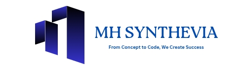

<a href="https://mhsynthevia.com">
    
    <a>
<html lang="en">
<head>
    <meta charset="UTF-8">
    <meta name="viewport" content="width=device-width, initial-scale=1.0">
    <title>MH Synthevia</title>
    
</head>
<body>
    <header>
        

            <h1>MH Synthevia</h1>
            <nav>
                <ul>
                    <li><a href="#home">Home</a></li>
                    <li><a href="#about">About Us</a></li>
                    <li><a href="#services">Services</a></li>
                    <li><a href="#testimonials">Testimonials</a></li>
                    <li><a href="#contact">Contact</a></li>
                    <li><a href="#Company-Info">Company Info</a></li>
                    <li><a href="#why-choose">Why Choose</a></li>
                </ul>
            </nav>
        

    </header>
    <main class="container">
        <section id="home">
            <h2>Welcome to MH Synthevia</h2>
            
At MH Synthevia, we are dedicated to transforming the way businesses harness the power of technology. As a leading IT company, we specialize in delivering innovative and customized solutions that meet the unique needs of each client. Our mission is to help organizations across industries navigate the ever-evolving digital landscape and achieve sustainable growth through technology-driven strategies.

        </section>
        <!-- About Us Section -->
        <section id="about">
            <h2>Who We Are</h2>
            
MH Synthevia is more than just an IT service provider – we are your trusted partner in navigating the complexities of the modern business world. Our team of skilled professionals brings together diverse expertise in software development, IT consulting, cloud services, cybersecurity, and data analytics, enabling us to deliver tailored solutions that drive results.

            
Founded on the principles of innovation, integrity, and customer satisfaction, we have built a strong reputation for excellence and reliability. Our team works closely with clients to understand their specific challenges, identify opportunities for improvement, and design solutions that enhance operational efficiency and competitive advantage.

        </section>
        <section id="services" class="services">
            <h2>Our Services</h2>
            <ul>
                <li>
                    <h3>Custom Software Development</h3>
                    
Our expert developers specialize in building custom software solutions that cater to the unique requirements of your business. From web applications to mobile apps, we create scalable and secure systems that streamline your operations and improve user experiences.

                </li>
                <li>
                    <h3>Cloud Solutions</h3>
                    
MHSynthevia offers cutting-edge cloud services to help you leverage the power of the cloud for enhanced collaboration, scalability, and cost savings. We assist in cloud migration, management, and optimization to ensure your business is always connected and ready for the future.

                </li>
                <li>
                    <h3>Cybersecurity</h3>
                    
Protecting your data and systems is our top priority. We provide comprehensive cybersecurity solutions, including risk assessment, vulnerability management, and real-time threat detection, ensuring your business remains secure in a world where cyber threats are ever-present.

                </li>
                <li>
                    <h3>IT Consulting</h3>
                    
Our IT consultants work with your team to develop strategic technology roadmaps that align with your business goals. Whether you're looking to modernize your IT infrastructure or optimize your existing systems, we offer expert guidance to drive innovation and efficiency.

                </li>
                <li>
                    <h3>Data Analytics</h3>
                    
In today's data-driven world, insights are key to making informed decisions. We help businesses harness the power of data analytics to uncover trends, improve operations, and deliver actionable insights that enhance decision-making and performance.

                </li>
            </ul>
        </section>
        <!-- Why Choose Us Section -->
        <section id="why-choose">
            <h2>Why Choose MH Synthevia?</h2>
            <ul>
                <li><strong>Innovative Solutions:</strong> We stay ahead of the curve, leveraging the latest technologies and industry best practices to deliver solutions that drive innovation and future-proof your business.</li>
                <li><strong>Tailored Approach:</strong> Every business is unique. We take the time to understand your needs and develop solutions that are specifically designed to solve your challenges and meet your goals.</li>
                <li><strong>Expert Team:</strong> Our team of seasoned professionals brings years of experience in the IT industry, ensuring that you receive top-notch service and expert guidance every step of the way.</li>
                <li><strong>Customer-Centric Focus:</strong> We believe in building long-term relationships with our clients. Your success is our success, and we are committed to providing the support and service you need to thrive in a competitive marketplace.</li>
            </ul>            
        </section>
        <!-- Commitment to Excellence Section -->
        <section id="commitment">
            <h2>Our Commitment to Excellence</h2>
            
At MH Synthevia, we are passionate about helping businesses leverage the potential of technology to improve their operations and achieve their objectives. Our commitment to excellence is reflected in everything we do, from the quality of our services to the dedication of our team.

            
We understand that the world of technology is constantly evolving, and we are here to help you stay ahead of the curve. Whether you're looking to streamline your operations, enhance your security posture, or drive innovation, MH Synthevia is the IT partner you can trust.

        </section>
        <section id="testimonials" class="testimonials">
            <h2>Testimonials</h2>
            
"MH Synthevia transformed our IT infrastructure and boosted our productivity. Highly recommend!" - Client A

            
"Excellent service and support. Our go-to IT partner!" - Client B

        </section>
        <section id="contact" class="contact-info">
            <h2>Contact Us</h2>
            <form id="contact-form">
                <label for="name">Name:</label>
                <input type="text" id="name" name="name" required>
                <label for="email">Email:</label>
                <input type="email" id="email" name="email" required>
                <label for="message">Message:</label>
                <textarea id="message" name="message" required></textarea>
                <button type="submit">Submit</button>
            </form>
        </section>
        <section id="Company-Info" class="contact-info">
            <h2>Company Info</h2>
            
Email: info@mhsynthevia.com

            
Contact Number: +1-332-288-1844

            
Website: mhsynthevia.com

            
Address: Office Court Building 228, Oud Maitha road Oud Metha, Bur Dubai, Dubai, United Arab Emirates  PO Box: 115304

            
Company type: Information Technology Company

        </section>
    </main>
    <footer>
        
© 2025 MH Synthevia. All rights reserved.

    </footer>
    
</body>
</html>
